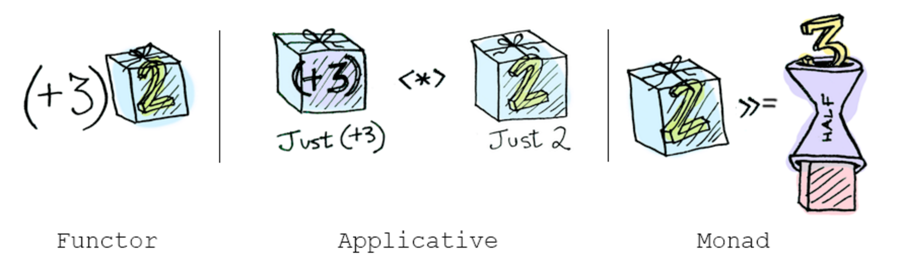
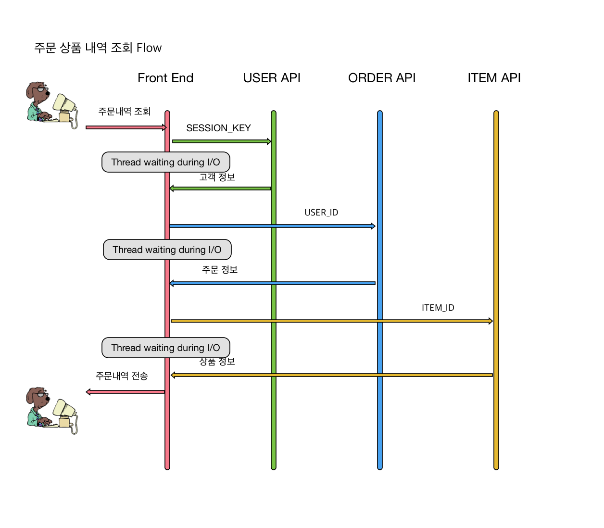

# Monad Progamming with Scala Future

함수형 언어에 대해서 공부를 하다보면 언제나 `Monad`라는 녀석을 마주치게 된다. [Category Theory][1]의 수학적인 개념이 바탕이 되어 있는 Monad에 대하여 보면, 어렵고 난해해서 많은 사람들이 Monad를 학습하는 과정에서 함수형 언어를 포기하는 경우가 많이 있다. 하지만 Monad라는 장벽을 넘어서고 나면, 아니 조금만 이해하고 나면 함수형 언어를 개발하는데 있어서의 이해도와 생산성이 급속도로 높아지게 된다. [Learning Curves (for different programming languages)][2]라는 글에 보면 여러 언어의 학습과정에서 나타다는 다양한 특징을 그래프로 보여준다. 그중에 Haskell의 경우 Monad의 대한 이해 과정을 거치기 전과 후가 확연하게 차이가 나는것을 볼수 있다.


나도 Monad에 대해서 이해하고 싶다는 욕심이 생겼고 그 과정을 통해서 겪었던 과정과 Scala의 [`Future`][13]를 이용한 예제를 통해서 어렵다는 Monad에 대해서 한발짝 다가가보자 한다.

## Monad 방황기
Monad 공부의 시작은 늘 그랬듯이 [구글링을 통한 검색][14]이었다. 구글의 [페이지 랭크 알고리즘][19]이 추천해주는 링크를 따라서 생각없이 위키피디아의 [`Monad (category theory)`][1]로 첫문을 열었다.
> 


이건 뭐지... 알수 없는 말들 뿐이었다.

> `방황` - 내가 전공이 수학과가 아니라서 그런거야, 난 개발자니까 프로그래밍으로 된걸 보면 이해가 될거라 생각했다.

Monad와 연관 검색어로 같이 등장하는게 Haskell이었다. 이번엔 Haskell 공식 홈페이지의 [Monad tutorial][2]을 읽어 보았다.

```haskell
-- The Monad class defines two basic operators: >>= (bind) and return.

infixl 1  >>, >>=
class  Monad m  where
  (>>=)            :: m a -> (a -> m b) -> m b
  (>>)             :: m a -> m b -> m b
  return           :: a -> m a
  fail             :: String -> m a

m >> k           =  m >>= \_ -> k
```

> `혼돈` - 이 알수 없는 화살표와 심볼들은 뭐지? 아직 내가 Haskell을 잘 몰라서 그런거야, 내가 조금더 익숙한 언어로된 설명을 보면 된다 생각했다.

이번엔 Javascript를 활용한 Monad를 설명해놓은 글([Monad in Javascript][4], [번역글][5])이 있었다. Javascript면 문법도 단순하고 쉽게 이해할 수 있을거라 생각했다.
```typescript
// 타입 스크립트로 Monad의 인터페이스를 설계함
interface MStatic<T> {
    // constructor that wraps value
    new(value: T): M<T>;
}

interface M<T> {
    // bind as an instance method
    bind<U>(transform: (value: T) => M<U>): M<U>;
}
```
> `의문` - 방황과 혼돈을 겪고나서 unit과 bind는 어렴풋이 알겠는데 이걸가지고 뭘하라는거지? 어떻게 활용하고 이게 왜 필요한거지? 라는 의문점이 들기 시작했다.

아직 내가 Monad에 대해서 이해를 못하고 있어서 그런 것 같아 더 쉬운 설명서를 찾아보기로 했다.
이번엔 그림으로 설명하는 Monads([Functors, Applicatives, And Monads In Pictures][8], [번역글][9])가 있어서 보았다.


> `좌절` - Monad에 대해서 이해하려 여기 왔는데, Monad만 점령하면 될줄 알았는데 Functor와 Applicative란 개념이 있었다. 이 용어들은 뭐지? 아... 함수형 언어의 길은 멀고도 험난하다.

## Monad 적응기
나름 많은 글과 자료를 보았지만 추상적인 Monad의 개념을 이해하기에는 역부족이었다. 선생님이 필요했다.
Scala 공부하는데 있어서 bible이라 불리는 [Coursera][17]의 두개의 Scala 과정
[Functional Programming Principles in Scala][10],
[Principles of Reactive Programming][11]을 통해서
Scala의 창시자인 [Martin Ordersky][15]와 Rx, Linq의 설계자인 [Eric Meijer][16]의 가르침을 선사받았다.

Martin Ordersky는 대학 교수님 답게 모나드의 수학적인 기초와 이를 Scala로 예를 들어가면서 차근 차근 알려주었다.
> 
> Martin Ordersky 강의 중 Monad의 3개의 법칙에 대한 설명의 일부이다.

또한 Eric Meijer는 [어둠의 해커 출신][18]으로 개발자에게 좀 더 친숙하게 실용적인 측면에서의 모나드를 활용한 프로그래밍을 설명해주었다.
> 
> Eric Meijer의 `Try[T]` 타입에 대한 설명 중 일부, Monad를 사용하면 어떤게 좋아진다는걸 확실히 알려준다.

Eric Meijer는 [MS에서 Haskell을 이용한 함수형 언어 강좌][21]를 꾸준히 했었고 현재 edx.org에서도 [Introduction to Functional Programming][20]이란 주제로 강의를 하고 있다.
> `괴담` - Cousera 강의를 듣고 과제를 풀고 실제 함수형 언어를 사용하면서 Monad의 문이 열리고 이해가 되기 시작하였다. 정확하게 말하면 Monad를 이해했다기 보다는 사용할 줄 안다는 표현이 맞을 것이다.
> 이제 [모나드 괴담][12]은 괴담일 뿐이었다. :trollface:

## Monad 가지고 놀기
Monad에 대해서 몰라도 된다. Monad를 배운다는데 Monad에 대해서 몰라도 된다니 모순된 말이다.
하지만 실제 Monad에 대한 이해가 없어도 Monad 프로그래밍을 할 수 있다.

그럼 비동기 프로그램을 Monad를 이용해서 구현해보자.
구현에는 Scala의 [`Future[T]`][22]라는 타입을 사용한다.
Future를 활용한 다양한 함수를 조합하는 프로그래밍을 할 것이고 그것이 첫번째 Monad를 활용한 프로그래밍이 될 것이다.

이제 잠시 Monad란 용어를 쓰지 않겠다. 아니 쓸 필요가 없을 것이다.


### Scala Future에 대해서 알아보기
[Scala 공식 API문서][38]에 보면 Future에 대한 설명은 간단하다.
```scala
// Asynchronous computations that yield futures are created with the Future call

val s = "Hello"
val f: Future[String] = Future {
  s + " future!"
}
f onSuccess {
  case msg => println(msg)
}
```

Future는 이름 그대로 미래의 값을 저장하고 있는 객체라 생각하면 된다. Future에 저장되어 있는 값은 특정 연산(IO, CPU)이 끝나고 반환되는 시점에 그 값을 얻을 수 있다.
설명은 이거면 충분하다. Future의 다른 부가적인 API들은 차근차근 알아가면 된다. 한 번에 다 알 필요가 없다.

### Scala Future로 비동기 프로그래밍하기
쇼핑몰에서 유저가 주문정보페이지를 통해 주문내역을 조회 할 수 있는 프로그램을 구현해보자.
실제 구현은 이보다 복잡하지만 최소한의 핵심 기능과 동기화 프로그래밍에서 발생하는 `Blocking I/O`에 대해서만 아래 그림과 같이 표현 해보았다. 


이 `Blocking I/O` 구간을 `Non Blocking I/O`로 바꿀것이다.

#### Step 0 - NIO를 사용할수 있는 Http Client 선택
NIO를 활용하기 위해서는 다양한 라이브러리 혹은 프레임웍의 지원을 확인해보고 필요에 따라 선택하여 사용하면 될 것이다.
* [Netty Async Http Client][23]
* [Finagle Client - Http][24]
* [Akka Http(Client-Side)][25]
* [Play Framework][26]
* 그 외 많은 오픈 소스 프로젝트가 NIO를 지원하고 정말 원한다면 Java의 [NIO API][35]를 직접 사용할 수도 있을 것이다.

하지만 그러지 말자.


> Reinventing the wheel

#### Step 1 - Async interface를 정의
NIO로 데이터를 가져오기 때문에 모든 결과값은 Future에 담겨져서 온다.
```scala
// 세션 정보를 이용하여 유저 정보를 가져옴
def getUser(session: String) = Future[User] {
    userApi.getAsync(session)
}

// 특정 유저의 주문 정보를 가져옴
def getOrder(userId: Int) = Future[Order] {
  orderApi.getAsync(userId)
}

// 특정 주문의 상품 내역을 가져옴
def getOrderItems(orderId: Int) = Future[List[Item]] {
  itemApi.getAsync(orderId)
}
```


#### Step 2 - Blocking IO with Await#result

위에 정의된 함수들을 조합해서 주문 상품 내역을 가져와 보자.
Future에 값이 들어 있기 때문에 이를 가져오기 위해서 `Await#result`를 활용하였다.
```scala
// 유저 정보를 가져옴
val userFuture = getUser(user_session)
val user = Await.result(userFuture, timeout)  // Thread waiting during I/O

// 주문 정보를 가져옴
val orderFuture = getOrder(user.id)
val order = Await.result(orderFuture, timeout)  // Thread waiting during I/O

// 특정 주문의 상품 내역을 가져옴
val itemsFuture = getOrderItems(order.id)
val items = Await.result(itemsFuture, timeout)  // Thread waiting during I/O
println(s"## User Order Items : ${items}")
```

위의 코드를 보면 함수형 스타일이 아니라 절차 지향 스타일의 프로그래밍이 되었고 NIO Client를 사용하였지만 Await#result 함수 호출을 통해서 Blocking IO가 발생하였다.
아직은 비동기 프로그래밍이 아니다.

#### Step 3 - flatMap 연산자를 이용한 함수 합성
`Await#result`를 사용하지 않고 3개의 Future를 반환하는 함수를 엮어서 1개의 Future의 결과 `Future[List[Item]]`을 얻을 수 있다.
```scala
// flatMap을 이용한 3개의 future를 compostion해서 결과를 얻을 수 있다.

val itemsFuture : Future[List[Item]] =
  getUser(user_session).flatMap { case user =>
    getOrder(user.id).flatMap { case order =>
      getOrderItems(order.id)
   }
}
itemsFuture.foreach { items =>
  println(s"## User Order Items : ${items}")
}
```
여기서 flatMap은 Future에서 값이 들어올 때 해당 블록 { ... } 호출하여 비동기 연산이 연속적으로 가능하게 한다.
이는 Javascript에서 자주 사용하는 promise의 then 함수와 유사하다. 결과 값이 반환될 때 동작할 함수, callback을 등록해 놓는 방식이다.
```js
$http.get('/v1/api/some/path/')
  .then(function(data) {   // flatMap과 같은 역할을 한다.
    console.log(data);
});
```

Callback? Callback!! Callback 패턴은 [Callback Hell][27]이라 불리는 악명 높은 Anti-pattern 아닌가?


#### Step 4 - for comprehension을 이용한 함수 합성
Callback hell에서 벗어날 방법을 scala는 [for comprehension][28]을 통해서 멋지게 제공해주고 있다. [관련 내용][29]는 구글링을 통해서 금방 찾을 수 있다.
이제 flatMap의 `callback(lambda)` 방식을 사용하지 않고 코드를 고쳐 보겠다.

```scala
// for comprehension을 이용하여 callback을 사용하지 않고 3개의 함수를 합성하였다.
val itemsFuture : Future[List[Item]] = for {
  user <- getUserId(user_session)
  order <- getOrder(user.id)
  items <- getOrderItems(order.id)
} yield items

itemsFuture.map { items =>
  println(s"## User Order Items : ${items}")
}
```

위의 flatMap을 활용한 코드보다 간결해졌고 가독성 좋고, 유지보수 쉬운 좋은 코드로 변했다.

동기 코드를 작성할 때의 flow와 비슷하게 작성한 비동기 코드를 조금 더 개선하고 싶다.

#### Step 5 - scala async, await 이용한 보다 간단한 비동기 프로그래밍
[Scala Async][30]를 활용해보겠다. 이를 적용할려면 의존성이 추가되어야 하기때문에 `build.sbt`에 아래와 같이 추가해야한다.
```scala
libraryDependencies += "org.scala-lang.modules" %% "scala-async" % "0.9.5"
```
의존성 추가 후에 아래와 같이 async와 await 키워드를 사용하여 비동기 프로그램을 동기 프로그래밍과 비슷하게 할 수 있다.

```scala
import scala.async.Async.{async, await}

// non blocking 영역이 된다.
async {
  // async 영역 안에서의 await는 thread를 blocking 하지 않는다.
  val user = await(getUser(userSession))
  val order = await(getOrder(user.id))
  val items : List[Item] = await(getOrderItems(order.id))
  println(s"## User Order Items : ${items}")
}
```

## 무엇이 Monad인가?
우리가 비동기 프로그램을 위해서 사용한 Future가 Monad의 일종이다.
* `unit` - Monad는 특정 값에 대한 감싸기 규칙을 만든다.
* `bind|flatMap` - 감싼 값에 대해서 꺼낼 수 있는 방법을 제공해준다. 꺼낸 값을 가지고 원하는 형식으로 변형하고 그 값을 감싸서 반환한다.

이제 우리는 Monad를 활용한 프로그래밍을 할 수 있고 이미 했다.

위의 예제에서
```scala
session => Future[User] => flatMap => (User => Future[Order]) => flatMap => (Order => Future[List[Item]])

// 이 코드는 Monad의 flatMap 혹은 for comprehension을 통한 합성을 통해서 아래와 같이 바뀌게 된다.

session => Future[List[Item]]
```
Monad를 통한 함수 합성을 이미 한 것이다.
특히 Scala는 Haskell의 [do notation][36] 과 유사한 for comprehension을 통해서 여러개의 Monad를 연결하는 syntactic sugar을 제공하고 이를 활용했다.


## Scala Future는 Monad가 아니다?
Monad가 되려면 위의 Martin Ordersky의 강의에 나오는 3가지 법칙을 만족해야 한다. 하지만 scala의 Future는 결합의 법칙을 만족하지 못한다.
[Is Future in Scala a monad?][31]란 Stackoverflow의 질문과 답변을 보면 결과적으로
Future는 return값은 cache를 하고 있고, side-effect를 효과적으로 관리못하고 결합법칙을 만족하지 못해서 monad가 아니게 되고
scala의 Future는 Monadic이라는 표현을 써야한다.

### Scalaz Task - Monad의 법칙을 만족하는 Future
Monad의 법칙을 만족하기 위해서 [Scalaz][32]의 [Task][33]를 사용하면 된다.

#### Scala Future vs. Scalaz Task
Scalaz의 Task와 Scala의 Future은 return 값을 cache방식 이외에도 callback에 대한 처리방식도 차이가 난다.

* Scala Future : `futureA.flatMap(a => futureB)` 은 다른 thread에서 futureB가 실행된다.


* Scalaz Task :  `taskA.flatMap(a => taskB)`는 taskA와 같은 thread에서 taskB가 실행되어 context switching를 줄이는 최적화 기법도 적용되어 있다.


#### Future vs. Task Benchmark 성능비교

벤치마크를 보면 trampoline과 그에 대한 optimize에 대해서 성능이 많이 차이나는걸 확인할 수 있다.
이에 대한 자세한 내용은 아래 블로그를 참조 바란다.


> 참조 : http://blog.higher-order.com/blog/2015/06/18/easy-performance-wins-with-scalaz/

## Scala의 Monads
Monad 개념때문에 어려워 말고 다른 API처럼 사용하면 된다. 물론 개념을 자세히 알면 도움이 되겠지만 반대로 flatMap API를 사용하다 보면 Monad에 대한 이해가 늘어날 것이다.

스칼라에는 많은 타입이 flatMap과 for comprehention을 활용할 수 있는 `Monad | Monadic` 타입이다.

* Option[T]
* Try[T] - 이것도 결합의 법칙은 만족하지는 못함, 코세라의 강의에서 Martin Ordersky가 설명해준다.
* List[T]
* Future[T]
* 그외 type에 flatMap 함수가 있다면 Monad라 생각해도 크게 무리는 없을듯 하다.

> 모나드의 대한 보다 자세한 이야기는 위에 언급한 Cousera강좌와 [learning Scalaz][37] 그리고 친철히 예제와 함께 자세히 한글로 설명해주신 오현석님의 [enshahar/BasicFPinScala][7]의 문서를 참조하면 좋은 자료가 될 것이라 생각한다.

<br/><br/>


[1]: https://en.wikipedia.org/wiki/Monad_(category_theory)

[2]: https://github.com/Dobiasd/articles/blob/master/programming_language_learning_curves.md

[3]: https://www.haskell.org/tutorial/monads.html

[4]: https://curiosity-driven.org/monads-in-javascript

[5]: http://haruair.com/blog/2986

[6]: https://class.coursera.org/reactive-002/lecture/27

[7]: https://github.com/enshahar/BasicFPinScala/blob/master/Intermediate/Monad.md

[8]: http://adit.io/posts/2013-04-17-functors,_applicatives,_and_monads_in_pictures.html

[9]: http://lazyswamp.tistory.com/entry/functorsapplicativesandmonadsinpictures

[10]: https://www.coursera.org/course/progfun

[11]: https://www.coursera.org/course/reactive

[12]: https://e.xtendo.org/haskell/ko/monad_fear/slide

[13]: http://docs.scala-lang.org/overviews/core/futures.html

[14]: https://www.google.co.kr/search?q=monad

[15]: https://en.wikipedia.org/wiki/Martin_Odersky

[16]: https://en.wikipedia.org/wiki/Erik_Meijer_(computer_scientist)

[17]: https://www.coursera.org/

[18]: http://www.zdnet.co.kr/column/column_view.asp?artice_id=20151214081719

[19]: https://ko.wikipedia.org/wiki/%ED%8E%98%EC%9D%B4%EC%A7%80%EB%9E%AD%ED%81%AC

[20]: https://www.edx.org/course/introduction-functional-programming-delftx-fp101x-0

[21]: https://channel9.msdn.com/Series/C9-Lectures-Erik-Meijer-Functional-Programming-Fundamentals/Lecture-Series-Erik-Meijer-Functional-Programming-Fundamentals-Chapter-1

[22]: http://www.scala-lang.org/api/current/#scala.concurrent.Future

[23]: https://github.com/AsyncHttpClient/async-http-client

[24]: http://twitter.github.io/finagle/guide/Clients.html

[25]: http://doc.akka.io/docs/akka-stream-and-http-experimental/2.0.3/scala/http/client-side/index.html

[26]: https://www.playframework.com/

[27]: http://callbackhell.com/

[28]: http://docs.scala-lang.org/tutorials/tour/sequence-comprehensions.html

[29]: https://gist.github.com/loicdescotte/4044169

[30]: https://github.com/scala/async

[31]: http://stackoverflow.com/questions/27454798/is-future-in-scala-a-monad

[32]: https://github.com/scalaz/scalaz

[33]: http://timperrett.com/2014/07/20/scalaz-task-the-missing-documentation/

[34]: http://blog.higher-order.com/blog/2015/06/18/easy-performance-wins-with-scalaz/

[35]: https://docs.oracle.com/javase/7/docs/api/java/nio/package-summary.html

[36]: https://en.wikibooks.org/wiki/Haskell/do_notation

[37]: http://eed3si9n.com/learning-scalaz/

[38]: http://www.scala-lang.org/api/current/#scala.concurrent.Future
