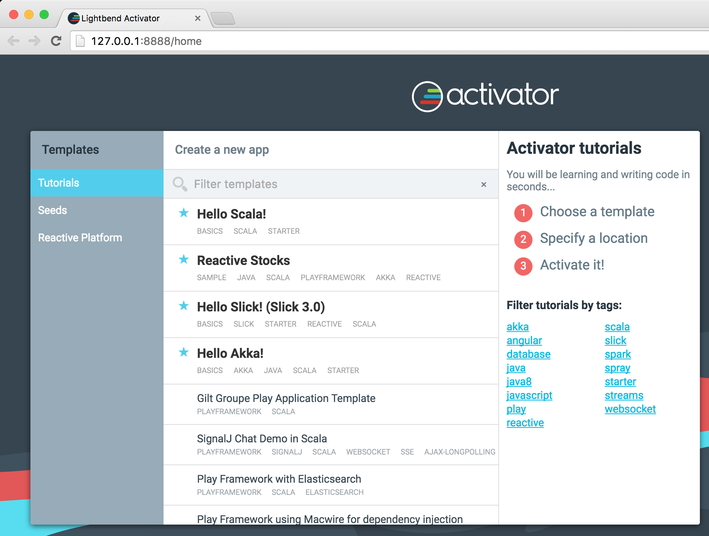
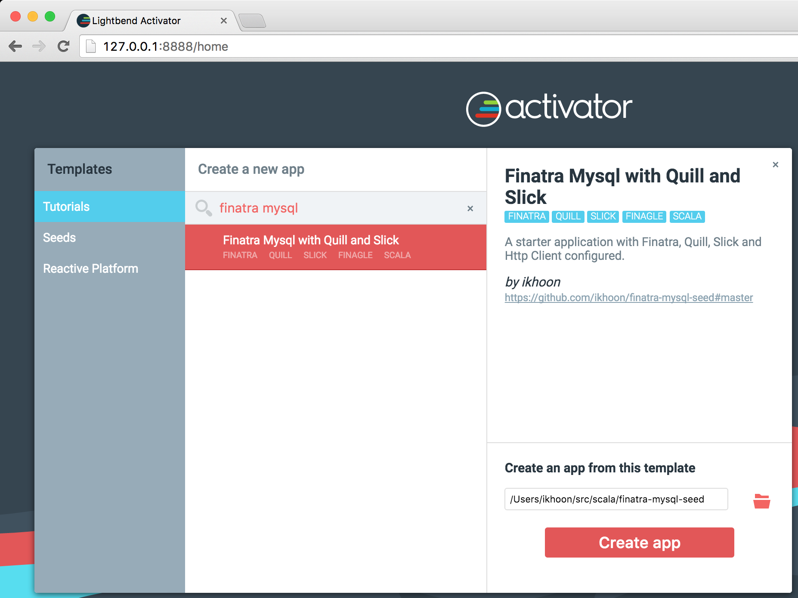
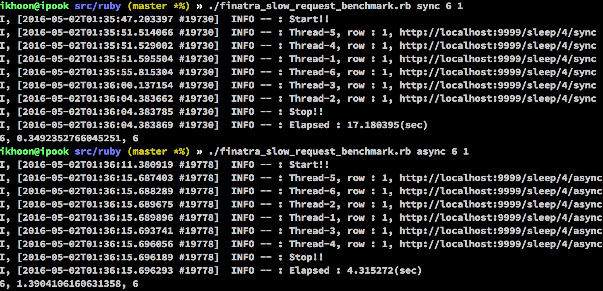
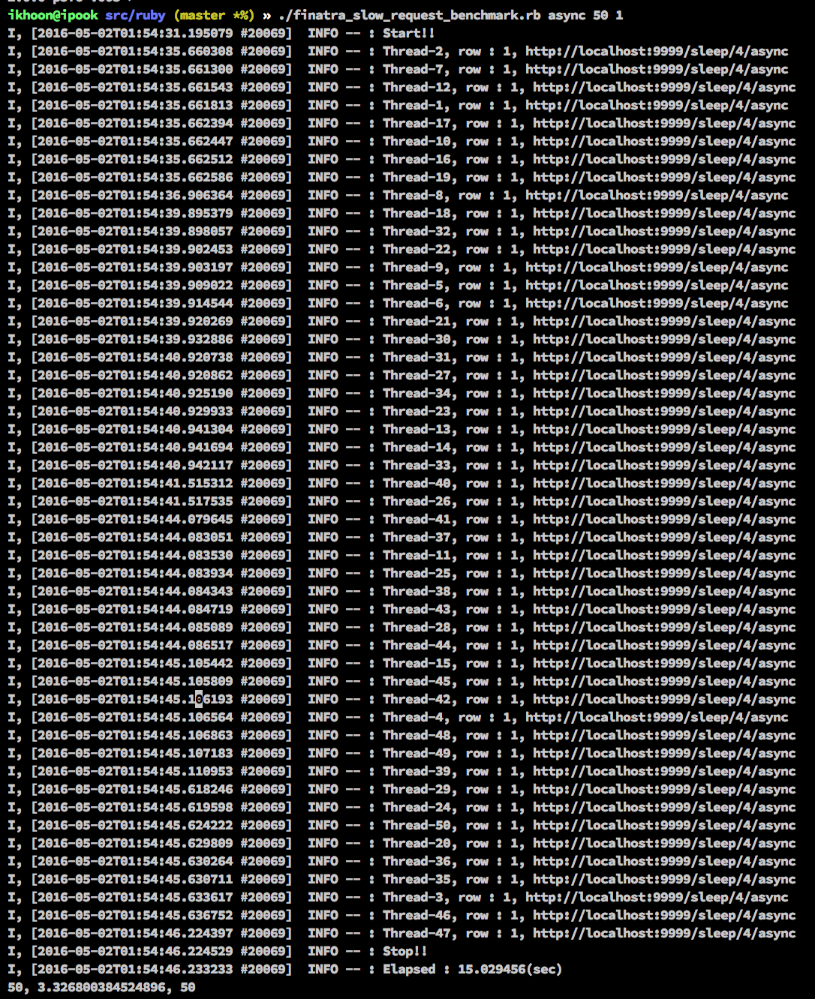

# Asynchronous Programming and Monad Transformers in Scala
자바와 스프링으로 웹서버를 개발하고 있다면 아래와 같이 HTTP 프로그래밍을 했을것이라 생각이 됩니다.
```java
// ItemApicontroller.java
import ...

@RestController
@RequestMapping("/api/items")
public class ItemApiController {
    @Autowired
    RestTemplate restTemplate;

    @RequestMapping(value = "/{id}", produces = MediaType.APPLICATION_JSON_VALUE)
    public ItemDto getItem(@PathVariable Long id) {
        // 응답이 올때 까지 thread는 대기하게 된다.
        return restTemplate.getForObject("http://remote-storage.com/fetch/item/" + id, ItemDto.class);
    }
}
```
익숙한 이상할것이 없은 동기화 프로그래밍 코드입니다.

동기화 방식은 아래와 같은 장점을 가지고 있습니다.
* 프로그래밍하기 간편하고 순차적으로 실행되기 때문에 상대적으로 개발하기 쉽습니다.
* Multi thread 환경을 고려하지 않아도 되기 때문에 디버깅하기 편합니다.
* Request가 thread를 독점하기 때문에 필요한 상태를 thread에 저장할수 있습니다.(stateful)

하지만 동기화 방식으로 개발하고 운영하다 보면 **thead pool hell**이라 불리는 아래와 같은 현상을 자주 마주하게 됩니다.

* 특정 API가 응답이 느릴경우 Request를 처리하는 thread는 blocking되고 응답이 오거나 timeout이 발생할때 까지는 thread는 waiting상태에서 머무르게 됩니다.
* 많은 수의 thread가 blocking되면 신규로 유입되는 request는 thread를 할당받지 못하고 요청을 처리를 못하게 됩니다.
* Thread pool의 thread 다 사용하면 request를 제대로 처리하지 못하고 [응답속도가 현저하게 느려지는 현상을 볼수 있습니다][8].


비동기 프로그래밍을 구현하면 아래와 같이 IO로 인해서 blocking되는 구간이 사라지게 되기 때문에 서버의 리소스(CPU, Memory, Network, Disk)를 충분히 활용할수 있습니다.


Spring 3.2버전 부터 [비동기 프로그래밍][13]을 지원하고 있고 [`AsyncRestTemplate.java`][37] API을 통해서 비동기 HTTP 프로그래밍을 지원하고 있지만 실제 개발 환경에서 여러개의 `Future` 효율적으로 조합(`flatMap`, [Monad Transformers][38]) 할수 없다면 이를 효과적으로 사용할수 없습니다. 이로인해 일부분만 비동기 프로그래밍으로 구현한다면 블록킹 IO로 인해 스레드 waiting현상이 발생하여 `thread pool hell`은 피할수 없게 됩니다.

지난번 포스팅에서 이야기 했던 [`Monad Programming with Scala Future`][39]에 이어를 `Future`를 Monad Transformers와 함께 사용하며 실전 web server programing에서 활용하고 이를 통해서 thread pool hell을 막을수 있는 방법에 대해서 알아보도록 하겠습니다.

Fully async programming을 지원해주는 **[Finatra][14] - Fast, testable, Scala services built on [Twitter-Server][15] and [Finagle][16]**를 사용해서 NIO programming을 해보겠습니다.

## Finatra
[Finatra][14]는 [트위터에서 만드는 오픈소스 프로젝트][17]로 Facebook의 [React][45]처럼 Twitter에서 [Production][18]환경에서 사용하고 있는 open source web framework입니다.
Finatra 이름의 기원은 Twitter의 [Finagle][16]과 Ruby의 [Sinatra][19]를 합친 합성어입니다.
> **Finatra** = **Fi**nagle + Si**natra**

Finatra는 Sinatra의 간결한 Routing DSL을 채용하였으며 finagle의 다양한 RPC 기능을 활용한 통신과 Twitter Server의 플래그 관리와 어드민 기능을 통합하여 직관적이며 빠르게 개발할수 있는 생산성 높은 web framework입니다.

Finatra로 개발하기 위해서는 두가지 핵심 코어 [Finagle][16]과 [Twitter-Server][15]에 대해서 알아보겠습니다.

### Finagle 알아보기
Finagle은 [트위터의 RPC 시스템][20]으로 [공식 문서에 나와 있는 프로토콜][21]은 [Thrift][27], [Mux][28], [Mysql][29]가 있고 [Github 프로젝트][40]를 보면 [fingle-memcached][24], [finagle-redis][22], [finagle-http][30], [finagle-http2][23] 등등 보다 다양한 프로토콜이 있습니다. Finagle을 활용하면 이들 프로토콜을 손쉽게 사용할수 있습니다.

이제 finagle의 RPC Client를 코드를 내부를 좀 더 파해쳐 보겠습니다.
내부코드를 보면 finagle RPC의 구현의 기본은 [`com.twitter.finagle.Client[Req, Rep]`][41] trait을 mixin하는걸로 되어 있습니다.

#### Finagle Memcached Client
아래는 하위프로젝트 [finagle-memcached][24]의 [com.twitter.finagle.Memcached.scala][25]의 소스 코드의 일부입니다.

```scala
// https://github.com/twitter/finagle/blob/develop/finagle-memcached/src/main/scala/com/twitter/finagle/Memcached.scala#L89
// finagle.Client trait을 mixin 해서 interface를 구현하고 있다.
trait MemcachedRichClient { self: finagle.Client[Command, Response] =>

  def newRichClient(dest: Name, label: String): memcached.Client =
    newTwemcacheClient(dest, label)

  def newRichClient(dest: String): memcached.Client = {
    val (n, l) = Resolver.evalLabeled(dest)
    newTwemcacheClient(n, l)
  }

  def newTwemcacheClient(dest: Name, label: String): TwemcacheClient

  def newTwemcacheClient(dest: String): TwemcacheClient = {
    val (n, l) = Resolver.evalLabeled(dest)
    newTwemcacheClient(n, l)
  }
}
```
Finagle의 이종 프로토콜간의 동일한 interface를 제공해주기 위해서 fingle.Client의 mixin을 강제하고 있습니다.
MemcachedRichClient에서는 `self: finagle.Client[Command, Response] =>` 표현을 사용하고 mixin하고 있습니다.

> self type annotation에 대해서는 akka 창시자인 [Jonas Bonér][53]의 [real-world scala: dependency injection (di)][52]와 stackoverflow의 [What is the difference between self-types and trait subclasses?][54]를 참조하면 좋은 자료가 될것이라 생각합니다.

#### Finagle Mysql Client
이번엔 [finagle-mysql][42]의 [com.twitter.finagle.Mysql.scala][26]의 구현의 일부를 보면
```scala
// https://github.com/twitter/finagle/blob/develop/finagle-mysql/src/main/scala/com/twitter/finagle/Mysql.scala#L18
// 위와 동일하게 finagle.Client trait를 mixin하고 이를 통해서 interface를 구현하고 있다.
trait MysqlRichClient { self: com.twitter.finagle.Client[Request, Result] =>

  def newRichClient(dest: Name, label: String): mysql.Client with mysql.Transactions =
    mysql.Client(newClient(dest, label))

  def newRichClient(dest: String): mysql.Client with mysql.Transactions =
    mysql.Client(newClient(dest))
}
```
MemcachedRichClient와 유사게 인터페이스가 설계되어 있으며 내부 구현은 `mysql.Client`로 숨겨져 있는것을 확인할수 있습니다.

Finagle의 모든 하위 RPC client 프로젝트는 `fingle.Client`를 구현하고 있어서 다양한 RPC 프로토콜이 모두 같은 interface를 가지게 됩니다.

### Finatra에서의 finagle의 역할
Finatra는 finagle의 [finagle-http][30]를 [HTTP 서버][43]로 사용하여 web framework이 설계되어 있습니다. [finagle-http은 netty][44]를 기반으로 구현 되어있어서 최종적으로 `finatra < finagle < netty`의 순으로 의존도가 있다고 생각하면 됩니다.

아래 finatra의 [BaseHttpServer.scala][55] 코드를 보면 에서 [com.twitter.finagle.Http.Server][43]를 이용하여 http server를 구성하고 있는것을 확인할수 있습니다.
```scala
// https://github.com/twitter/finatra/blob/develop/http/src/main/scala/com/twitter/finatra/http/internal/server/BaseHttpServer.scala

// Finatra BaseHttpserver 코드의 일부
package com.twitter.finatra.http.internal.server

// finagle Http를 import하고 있다.
import com.twitter.finagle.{ListeningServer, Http, Service}

trait BaseHttpServer extends TwitterServer {
...
  // import한 finagle.Http.server를 이용해서 Http서버를 만들고 있습니다.
  private lazy val baseHttpServer: Http.Server = {
    Http.server
      .withMaxRequestSize(maxRequestSizeFlag())
      .withStreaming(streamRequest)
  }
...
}
```

### [Twitter Server][15] 대해 알아보기
Finatra를 [Twitter Server][15]를 이용하여 엔터프라이즈급 서버에 필요한 다양한 모니터링 솔루션([어드민][32], [트래킹][31], [통계][33])과 [설정 플래그][34]와 같은 부분은 공통 컴포넌트화 해서 제공하고 있습니다.

아래 그림은 [Twitter Server 어드민 페이지][32]에서 볼수 있는 서버 모니터링 화면입니다.


## Finatra로 Fully Async HTTP 서버 개발 시작하기

### Step 0 - [Lightbend Activator][35] 설치 및 실행
```sh
# activator 다운로드
curl https://downloads.typesafe.com/typesafe-activator/1.3.10/typesafe-activator-1.3.10.zip \
-o typesafe-activator-1.3.10.zip
# 압축 해제
unzip typesafe-activator-1.3.10.zip
# activator 실행
activator-dist-1.3.10/bin/activator ui
```

위의 순서로 실행하면 아래와 같은 화면이 브라우저에 뜹니다.


### Step 1 - Finatra 프로젝트 생성
[finatra-mysql-seed][46] 프로젝트를 이용하여 finatra를 이용해서 개발하는 방법에 대해서 설명하겠습니다.
finatra-mysql-seed project는 finatra를 이용해서 개발한 부분중에서 재사용되는 부분을 template화 해서 만들어 놓은 project입니다.

설치 방법은 아래 3가지 방법중 1가지를 선택하여 설치하시면 됩니다.

* 선택 1(권장) - activator의 ui에서 `finatra-mysql-seed`검색해서 seed 프로젝트를 설치할 수 있습니다.



* 선택 2 - activator ui의 사용을 원하지 않을 경우 command line에서 아래 명령어를 실행하면 됩니다.

```sh
$ ./activator-dist-1.3.10/bin/activator new finatra-starter finatra-mysql-seed

Fetching the latest list of templates...

OK, application "finatra-starter" is being created using the "finatra-mysql-seed" template.

To run "finatra-starter" from the command line, "cd finatra-starter" then:
/Users/.../finatra-starter/activator run

To run the test for "finatra-starter" from the command line, "cd finatra-starter" then:
/Users/.../finatra-starter/activator test

To run the Activator UI for "finatra-stater" from the command line, "cd finatra-starter" then:
/Users/.../finatra-starter/activator ui
```

* 선택 3 - activator를 사용을 원하지 않으면 [sbt][36]를 사용하여 프로젝트를 활성화할수 있습니다.

```sh
git clone git@github.com:ikhoon/finatra-mysql-seed.git finatra-starter
```

### Step 2. 프로젝트를 시작하기
로컬에 mysql을 설치하고 seed project용 데이터베이스를 만들고 프로젝트를 시작합니다.
```sh
# mysql-server를 설치(아래는 OSX Homebrew기준으로 설명합니다.)
brew install mysql
mysqld # mysql-server 실행

# mysql table & data 초기화
cd finatra-starter
mysql -u root < sql/1.sql

# finatra server 실행
bin/activator run # git clone을 받은 경우 `sbt run`을 실행합니다.
...
[info] Loading project definition from finatra-starter/project
[info] Set current project to finatra-starter(in build file:finatra-starter/)
[info] Running com.github.ikhoon.FinatraServerMain
...
```

### Step 3. Controller 와 Route 추가하기
Ping메시지를 보내면 pong 메시지를 응답하는 간단한 [PingController][56]를 구현해봅니다. 기본 구현은 아래와 같습니다.
[Sinatra][19] 스타일의 HTTP 서버 개발 경험이 있다면 익숙한 표현 방식이라 생각이 됩니다.

```scala
// file: PingController.scala
package com.github.ikhoon.app.v1.ping

import javax.inject.Inject

import com.google.inject.Singleton
import com.twitter.finagle.http.Request
import com.twitter.finatra.http.Controller
import com.twitter.util.Future

case class Pong(pong: String)

@Singleton
class PingController @Inject() () extends Controller { // finatra.http.Controller를 상속 받습니다.

  // GET /ping URL을 처리하기 위한 router를 정의합니다.
  get("/ping") { request: Request =>
    Future.value(Pong("pong"))  // 비동기 프로그래밍을 위해서 `Future`로 값을 감싸서 return 합니다.
  }
}
```

방금 정의한 PingController의 router를 FinatraServer에 등록합니다.
```scala
package com.github.ikhoon

import com.github.ikhoon.app.v1.ping.PingController
import com.twitter.finagle.http.{ Request, Response }
import com.twitter.finatra.http.HttpServer
import com.twitter.finatra.http.routing.HttpRouter

object FinatraServerMain extends FinatraServer

class FinatraServer extends HttpServer {

  override def defaultFinatraHttpPort = ":9999"

  override def configureHttp(router: HttpRouter) {
    router
      .add[PingController] // Controller를 router에 등록합니다.
  }

}
```

이제 방금 등록한 Controller를 확인하기 위해서 `bin/activtor run`을 실행하거나 `sbt run`을 실행합니다. 실행후 브라우져나 `curl`로 command line에서 확인할수 있습니다.
```sh
curl -L -v localhost:9999/ping
*   Trying ::1...
* Connected to localhost (::1) port 9999 (#0)
> GET /ping HTTP/1.1
> Host: localhost:9999
> User-Agent: curl/7.43.0
> Accept: */*
>
< HTTP/1.1 200 OK
< Content-Type: application/json; charset=utf-8
< Server: Finatra
< Date: ?, 01 5? 2016 13:02:40 GMT
< Content-Length: 15
<
* Connection #0 to host localhost left intact
{"pong":"pong"}
```

### Step 4. Async Http Programming with Finagle Http Client
Finatra는 [Google Guice][47]를 이용한 경량화 Dependency Injection 모듈을 이용하여 의존성 주입및 [유닛 테스트, Mock 테스트][57]를 할수 있습니다.
Finagle Http Client를 의존성 주입하기 위해서는 접속할 서버의 정보(`host:port`)를 모듈을 생성하고 FinatraServer에 이를 등록해야 합니다. Twitter Server Admin페이지에서 등록된 finagle client host의 에러를 감지 및 트래킹할 수 있습니다.

Guice를 이용한 모듈을 만들기위해서는 [`TwitterModule`][48]을 상속 받아서 구현하면 됩니다.

약간의 편의성을 위해서 [Finatra HttpClient 기본 모듈][50]을 상속받아 수정해 봅니다. [finatra request builder][49]를 사용할 경우 [`Host Header`][51] 정보가 빠져서 HTTP통신이 되지 않아서 `RequestBuilder`에 매번 Host Header를 넣어줘야하는데 이를 피하기 위해 Header에 Host정보를 기본값으로 설정합니다.
```scala
abstract class BasicHttpClientModule() extends TwitterModule {

  protected def provideHttpClient(mapper: FinatraObjectMapper, host: String, port: Int = 80): HttpClient = {
    val httpClientModule = new HttpClientModule {  // 기본 HttpClientmodule을 상속받으면서 값을 override합니다.
      override def dest: String = s"$host:$port"
      override def defaultHeaders: Map[String, String] = Map("Host" -> host)  // 기본 Header값을 override 하면서 Host값을 설정합니다.
    }
    httpClientModule.provideHttpClient(mapper, httpClientModule.provideHttpService)
  }
}

```

이제 실제 HTTP 통신을 할 서버의 host명과 port정보를 이용해서 HttpClientModule을 만듭니다.
```scala
import com.twitter.finatra.json.FinatraObjectMapper
import com.typesafe.config.Config
import net.ceedubs.ficus.Ficus._
import com.twitter.finatra.httpclient.modules.HttpClientModule
object FakeHttpClientModule {
  def apply() = new BasicHttpClientModule {
    @Named("fake") @Provides @Singleton     // `fake`란 이름으로 의존성 주입될수 있도록 이름을 지어줌
    // jackson object mapper와 typesafe config를 의존성을 주입함
    def provideHttpClient(mapper: FinatraObjectMapper, config: Config) = {
      // 위에서 만들었던 `BasicHttpClientModule#provideHttpClient`를 호출하면서 typesafe config에 설정되어 있는 fake.host, fake.port값을 가져와 넘겨줌
      super.provideHttpClient(mapper, config.as[String]("fake.host"), config.as[Int]("fake.port"))
    }
  }
}
```

위에서 만든 FakeHttpClientModule을 FinatraServer에 등록을 합니다.
```scala
class FinatraServer extends HttpServer {
  override def modules = Seq(FakeHttpClientModule())
  ...
}
```

그리고 실제 비지니스 로직을 구현할 FakeService를 만들어 봅니다.
```scala
import javax.inject.{ Inject, Named }

import com.fasterxml.jackson.databind.JsonNode
import com.twitter.finatra.httpclient.{ HttpClient, RequestBuilder }
import com.twitter.util.Future
import com.typesafe.config.Config
import net.ceedubs.ficus.Ficus._

// @Named("fake") 어노테이션을 이용하여 위에서 정의한 HttpClient의 의존성을 주입합니다.
class FakeService @Inject() (@Named("fake") httpClient: HttpClient, config: Config) {
  def withSleepAsync(sec: Int): Future[JsonNode] = {
    val url = config.as[String]("fake.host") + s"?sleep=$sec"
    httpClient.executeJson[JsonNode](RequestBuilder.get(url))
  }


  def withSleepSync(sec: Int): JsonNode = {
    val url = config.as[String]("fake.host") + s"?sleep=$sec"
    val jsonNode = httpClient.executeJson[JsonNode](RequestBuilder.get(url))
    // 의도적으로 Blocking IO를 유발함
    Await.result(jsonNode, Duration.fromSeconds(100))
  }
}
```

FakeService를 FakeController를 만들어서 Guice를 통한 의존성 주입 & method 호출을 하고
```scala
import javax.inject.Inject

import com.github.ikhoon.swagger.SimpleSwaggerSupport
import com.twitter.finagle.http.Request
import com.twitter.finatra.http.Controller


class FakeController @Inject() (fakeService: FakeService) extends Controller {
  get("/sleep/:id/async") { request: Request =>
    fakeService.withSleepAsync(request.getIntParam("id"))
  }

  get("/sleep/:id/sync") { request: Request =>
    fakeService.withSleepSync(request.getIntParam("id"))
  }
}
```

FakeController를 다시 FinatraServer의 라우터에 등록을 합니다.
```scala
class FinatraServer extends HttpServer {
  override def modules = Seq(FakeHttpClientModule())
  ...
  override def configureHttp(router: HttpRouter) {
    router
      .add[FakeController]  // FakeController를 라우터에 등록

}
```

### Asynchronous vs Synchronous
이제 간단한 벤치마크를 실행해서 async와 sync의 결과값을 비교해보겠습니다.

위의 코드를 실행결과를 보면 4초의 IO Waiting이 걸리는 외부와 통신을 할때
* Sync IO - 6개의 request를 처리하는데 약 17초가 걸렸습니다. Thread가 blocking되기 때문에 동기화 코드는 서버의 `가용 thread 수`가 성능이 중요한 포인트가 됩니다.
* Async IO - 같은 서버에 6개의 request를 처리하는데 약 4.3초가 걸렸습니다. 여러개의 request가 비동기로 병렬로 처리가 되었습니다.

Async 코드에 대해서 Client의 Request를 50개까지 늘려서 성능을 측정해보겠습니다.

* 총 50개의 request를 처리하는데 15초가 걸렸습니다.  Async IO는 4초의 waiting이 발생하는 외부와 통신에서 context switch 비용이 발생하지만 많은 수의 request에 대해서도 동시 처리가 가능합니다.

> 밴치마크에 사용한 코드는 ruby로 아래와 같이 작성하였습니다.

```ruby
#!/usr/bin/env ruby
# finatra_slow_request_benchmark.rb
require 'logger'
require "rubygems"
require 'net/http'

LOG = Logger.new(STDOUT)

if ARGV.size != 3
  puts "usage #{$0} [mode(sync|async)] [thread_size] [iteration_size]"
  exit
end

MODE = ARGV[0]
THREAD_SIZE = ARGV[1].to_i
ITERATION_SIZE = ARGV[2].to_i

SYNC_SLOW_URI = URI("http://localhost:9999/sleep/4/sync")
ASYNC_SLOW_URI = URI("http://localhost:9999/sleep/4/async")

def init
  Net::HTTP.get(URI("http://localhost:9999"))
end

def request_url(thread_id, uri)
    (1..ITERATION_SIZE).each do | count |
      response = Net::HTTP.get(uri)
      LOG.info "Thread-#{thread_id}, row : #{count}, #{uri}"
    end
end

begin
  init
  start = Time.new
  LOG.info "Start!!"
  uri = MODE == 'sync' ? SYNC_SLOW_URI : ASYNC_SLOW_URI

  (1..THREAD_SIZE).map { | tid | Thread.new { request_url(tid, uri) } }.each { | t | t.join }

  stop = Time.new

  LOG.info "Stop!!"
  elapsed = stop - start

  LOG.info "Elapsed : #{elapsed}(sec)"
  executed_queries = THREAD_SIZE * ITERATION_SIZE
  tps = executed_queries / elapsed
  puts "#{THREAD_SIZE}, #{tps}, #{executed_queries}"
end
```

## Monad Transformers - 보다 효율적인 비동기 프로그래밍 하기
아직은 단순한 케이스의 대해서만 비동기 프로그래밍을 했습니다.
실제 웹서비스를 개발하다 보면 다양한 복잡한 케이스에 만나게 됩니다.

주문 서버에서 주문 리스트를 가져오고 아이템 서버로 각각의 주문의 상품에 대해서 데이터를 비동기로 가져오는 것을 구현해보겠습니다.
```scala
// 주문내역을 가져오는 API
case class Order(id: Int, userId: Long, addr: String)
case class Item(id: Int, name: String, price: Long)

val orders = Map(
  1 -> List(Order(1, 1, "Seoul"), Order(2, 1, "Seoul")),
  2 -> List(Order(3, 2, "Tokyo"), Order(4, 2, "Tokyo")),
  3 -> List(Order(5, 3, "NewYork"),Order(6, 3, "NewYork")),
  4 -> List(Order(7, 4, "Daegu"), Order(8, 4, "Daegu"))
)

val orderItems = Map(
  1 -> List(Item(1, "I1", 2000), Item(2, "I2", 4000)),
  2 -> List(Item(2, "I2", 4000), Item(3, "I3", 6000), Item(4, "I4", 8000)),
  3 -> List(Item(3, "I3", 6000), Item(4, "I4", 8000), Item(5, "I5", 10000)),
  4 -> List(Item(4, "I4", 4000), Item(5, "I5", 10000), Item(6, "I6", 12000)),
  5 -> List(Item(1, "I1", 2000), Item(2, "I2", 4000), Item(3, "I3", 6000)),
  6 -> List(Item(2, "I2", 4000), Item(4, "I4", 8000)),
  7 -> List(Item(3, "I3", 6000), Item(4, "I4", 8000), Item(5, "I5", 10000), Item(6, "I6", 12000)),
  8 -> List(Item(4, "I4", 4000), Item(5, "I5", 10000), Item(7, "I7", 14000))
)

// 주문내역을 가져오는 API
def getOrders(userId: Int): Future[List[Order]] = Future.successful(orders.get(userId).get)
// 주문의 상품 내역을 가져오는 API
def getOrderItems(order: Order): Future[List[Item]] = Future.successful(orderItems.get(order.id).get)
```
여기서의 문제점은 Future안에 List가 들어있다는 것입니다. 주문의 상품내역을 가져오려면 List에서 다시 Order를 추출해내야합니다.
for comprehension 만을 이용하여 데이터를 비동기로 가져와 보겠습니다.
```scala
import scala.concurrent.Future
import scala.concurrent.ExecutionContext.Implicits.global

val userId = 1
val orderItems = for {
  // 비동기로 유저의 상품내역을 가져옴
  orderList: List[Order] <- getOrders(userId)
  // 주문 상품내역을 추출하기 위해서는 List에서 Order값을 가져와야함
  itemList: List[Item] <- {
    val itemListFutureList: List[Future[List[Item]]] = for {
        order <- orderList
      } yield getOrderItems(order)
    // itemListFutureList가 List안에 Future가 들어있기 때문에 Future의 sequence 함수를 통해서 순서를 변경합니다.
    val itemFutureListList: Future[List[List[Item]]] = Future.sequence(itemListFutureList)
    // 변경된 Future안에 List가 중첩해서 들어있기 때문에 flatten 함수를 이용해서 이를 없애줍니다.
    val itemFutureList: Future[List[Item]] = itemFutureListList.map(_.flatten)
    // 이제 itemFutureList는 상위 for comprehension을 돌수있는 monad의 형태 Future[M[T]]의 형태가 되었습니다.
    itemFutureList
  }
} yield (itemList)
orderItems.foreach(println)
// List(Item(1,I1,2000), Item(2,I2,4000), Item(2,I2,4000), Item(3,I3,6000), Item(4,I4,8000))
```

위의 코드는 로직이 복잡하고 가독성도 떨어집니다. 실제 사용이 거의 불가능한 코드라 생각이 됩니다.
기존의 for comprehension은 중첩된 모나드를 효율적으로 처리할수 없습니다.
하지만 [Monad Transformers][58]란 개념을 활용하면 새로운 `flatMap(A => Future[List[B]])` 함수를 만들고 이를 간단하게 처리할수 있습니다. :blush:

### List Monad Transformer 만들어 보기
우선 `FutureSeq`라는 case class를 하나 만들고 인자로 `Future[Seq[A]]`를 받도록 합니다.
`List`는 `Seq`를 상속 받기 때문에 `Future[List[A]]`도 인자로 받을수 있게 됩니다.
그리고 `flatMap`, `map`, `filter` 그리고 `withfilter`를 구현해주면 됩니다.

* `flatMap` 함수는 for comprehension에서 `<-` 연산을 가능하게 합니다 `for { a <- ma }`
* `withFilter` 함수는 for 문 안에서 `if` 조건을 사용 할수 있게 합니다. `for { a <- ma if a == 10 }`

```scala
case class FutureSeq[+A](future: Future[Seq[A]]) extends AnyVal {
  def flatMap[B](f: A => FutureSeq[B])(implicit ec: ExecutionContext): FutureSeq[B] =
    FutureSeq(future.flatMap {
      case a => Future.sequence(a.map(f andThen (_.future))).map(_.flatten)
    })

  def map[B](f: A => B)(implicit ec: ExecutionContext): FutureSeq[B] = FutureSeq(future.map(_.map(f)))

  def filter(p: A ⇒ Boolean)(implicit ec: ExecutionContext): FutureSeq[A] = withFilter(p)(ec)

  def withFilter(p: A ⇒ Boolean)(implicit ec: ExecutionContext): FutureSeq[A] =
    FutureSeq(future.map(_.filter(p)))
}
```
이제 FutureSeq monad transformer를 만들었으니 위의 주문내역을 가져오는 코드를 리팩토링 해보겠습니다.

```
import scala.concurrent.Future
import scala.concurrent.ExecutionContext.Implicits.global
val orderItems = for {
  order: Order <- FutureSeq(getOrders(userId))
  item: Item <- FutureSeq(getOrderItems(order))
} yield item
orderItems.future.foreach(println)
// List(Item(1,I1,2000), Item(2,I2,4000), Item(2,I2,4000), Item(3,I3,6000), Item(4,I4,8000))
```
Monad Transformer를 통해서 훨씬 가독성이 좋고 유지보수하기 좋은 코드로 바뀌었습니다.

Monad Transformer를 간단하게 만들어 봤으나 scalaz, cats와 같은 라이브러리에 이미 유용한 Monad Transformers가 존재하니 필요하다면 찾아서 사용해도 좋습니다.
위의 코드를 scalaz의 [ListT Monad Transformers][70]를 활용하면 아래와 같이 사용할수 있다.

```scala
import scalaz._
import Scalaz._
import ListT._
import scala.concurrent.Future
import scala.concurrent.ExecutionContext.Implicits.global
val orderItems = for {
  order: Order <- listT(getOrders(userId))
  item: Item <- listT(getOrderItems(order))
} yield item
orderItems.run.foreach(println)
// List(Item(1,I1,2000), Item(2,I2,4000), Item(2,I2,4000), Item(3,I3,6000), Item(4,I4,8000))
```
위에 직접 만든 Monad Transformer와 같은 역할을 하게 되고 코드량도 거의 같습니다.

## 두번째 Monad Transformer 만들어보기

Web application을 개발하다보면 Database와의 연동 작업, 특정 키값으로 데이터를 조회하는 일이 많이 있습니다.
Java에서는 데이터가 없는 경우에 null이 반환되지만 Scala에서는 nullable한 데이터에 대해서는 `Option[T]`로 표현을 합니다.

특정 유저의 email을 가지고 그 유저의 현재 남아 있는 point를 조회하는 로직을 구현해보겠습니다.
우선 [Quill][65]과 finagle-mysql의 조합으로 Mysql에 들어있는 데이터를 조회해보도록 하겠습니다.

Users Table 조회
```scala
import javax.inject.{ Inject, Singleton }
import java.util.Date
import com.github.ikhoon.modules.QuillDatabaseModule.QuillDatabaseSource
import com.twitter.util.Future
import io.getquill._

// Users 테이블의 모델 정의
case class Users(id: Int, name: String, email: String, createdAt: Date)

@Singleton
class QuillUserRepository @Inject() (db: QuillDatabaseSource) {

  // Email을 가지고 user 정보를 가져오는 쿼리 수행
  def findByEmail(email: String): Future[Option[Users]] = {
    val q = quote { (email: String) =>
      query[Users].filter(i => i.email == email).take(1)
    }
    db.run(q)(email).map(_.headOption)
  }
}
```

Point Table 조회
```scala

import javax.inject.{ Inject, Singleton }
import java.util.Date
import com.github.ikhoon.modules.QuillDatabaseModule._
import com.twitter.util.Future
import io.getquill._

// Points 테이블의 모델 정의
case class Points(id: Int, userId: Int, point: Int, createdAt: Date)

@Singleton
class QuillPointRepository @Inject() (db: QuillDatabaseSource) {

  // Uesr ID를 가지고 포인트 정보를 가져오는 쿼리수행
  def findByUserId(userId: Int): Future[Option[Points]] = {
    val q = quote { (userId: Int) =>
      query[Points].filter(p => p.userId == userId).take(1)
    }
    db.run(q)(userId).map(_.headOption)
  }

}
```
이제 두개의 유저의 email을 가지고 point를 가져와 보겠습니다.

```scala
class UserPointService @Inject() (
  quillUserRepository:  QuillUserRepository,
  quillPointRepository: QuillPointRepository
) {
  def getPointByUserEmail(email: String): Future[Option[Points]] =
    for {
      userOption: Option[Users] <- quillUserRepository.findByEmail(email)
      // option 타입이기 때문에 quillPointRepository.findByUserid 를 호출할수 없기 때문에 pattern matching 을 통해서 이부분을 해결합니다.
      pointOption: Option[Points] <- userOption match {
        case Some(user) => quillPointRepository.findByUserId(user.id)
        case _          => Future.value(None)
      }
    } yield pointOption
```
Future안에 List가 있는 경우보다는 간단한 로직이지만 여전히 사용하기 불편합니다.
이부분도 Monad Transformer를 활용해서 수정해보겠습니다.

### Option Monad Transformer 활용한 Future[Option[T]] 데이터 조합
특정값 A 를 받아서 Future[Option[B]]를 반환하는 `flatMap(A => Future[Option[B]])` 함수를 만들고 이를 통해서 Option Monad Transformer를 만들어 보겠습니다.
기본 구조는 위의 FutureSeq 와 똑같습니다. 다만 내부 구현이 조금씩 차이가 납니다.

```scala
case class FutureOption[+A](future: Future[Option[A]]) extends AnyVal {
  def flatMap[B](f: A => FutureOption[B])(implicit ec: ExecutionContext): FutureOption[B] =
    FutureOption(future.flatMap {
      case Some(a) => f(a).future
      case None    => Future.value(None)
    })

  def map[B](f: A => B)(implicit ec: ExecutionContext): FutureOption[B] = FutureOption(future.map(_.map(f)))

  def filter(p: A ⇒ Boolean)(implicit ec: ExecutionContext): FutureOption[A] = withFilter(p)(ec)

  def withFilter(p: A ⇒ Boolean)(implicit ec: ExecutionContext): FutureOption[A] =
    FutureOption(future.map {
      case Some(a) => if (p(a)) Some(a) else None
      case _       => None
    })
}
```
이제 새롭게 만든 Option Monad Transformer를 활용해서 원래 코드를 수정해보겠습니다.
```scala
def getPointByUserEmail(email: String): Future[Option[Points]] =
  (for {
    user <- FutureOption(quillUserRepository.findByEmail(email))
    point <- FutureOption(quillPointRepository.findByUserId(user.id))
  } yield point).future
```

코드가 훨씬더 간결해지고 편리하게 두개의 함수의 결과값을 조합할 수 있습니다.
FutureOption 또한 scalaz의 OptionT Monad Transformer를 사용하면 동일하게 구현할 수 있습니다.

```scala
import scalaz._
import Scalaz._
import OptionT._
import scala.concurrent.Future
import scala.concurrent.ExecutionContext.Implicits.global
def getPointByUserEmail(email: String): Future[Option[Points]] =
  (for {
    user <- optionT(quillUserRepository.findByEmail(email))
    point <- optionT(quillPointRepository.findByUserId(user.id))
  } yield point).run
```

비동기 프로그래밍을 하다 보면 `Future`안에 감싸져 있는 값을 처리하기 쉽지 않은 경우가 종종 생깁니다.
[Scalaz][64]에는 자주쓰이는 Monad Transformers에 대해서 구현이 되어 있습니다. [OptionT][59], [EitherT][60], [ListT][61], [StreamT][62], [StateT][63] 이외에 [다양한 Monad Transformers][64]가 존재합니다.

적절한 Monad Transformers를 찾아보고 없으면 직접 구현하는것도 좋을것 방법이라 생각이 됩니다.

## 광고 영역
채용광고 넣을예정 :)

[1]: https://en.wikipedia.org/wiki/Thread_(computing)
[2]: http://stackoverflow.com/a/6347589/1736581
[3]: https://stackoverflow.com/questions/5483047/why-is-creating-a-thread-said-to-be-expensive/5483105#5483105
[4]: http://www3.nd.edu/~dthain/courses/cse30341/spring2009/project4/project4.html
[5]: http://martinfowler.com/articles/microservices.html
[6]: https://thrift.apache.org/
[7]: https://developers.google.com/protocol-buffers/
[8]: http://www.slideshare.net/brikis98/the-play-framework-at-linkedin
[9]: http://www.reactive-streams.org/announce-1.0.0
[10]: https://en.wikipedia.org/wiki/Non-blocking_I/O_(Java)
[11]: https://github.com/playframework/playframework/tree/master/framework/src/play-netty-server/src/main/scala/play/core/server
[12]: https://en.wikipedia.org/wiki/Representational_state_transfer
[13]: http://docs.spring.io/spring-framework/docs/current/spring-framework-reference/html/mvc.html#mvc-ann-async
[14]: https://twitter.github.io/finatra/
[15]: http://twitter.github.io/twitter-server/
[16]: http://twitter.github.io/finagle/
[17]: https://engineering.twitter.com/opensource/projects/finatra
[18]: https://twitter.github.io/finatra/assets/FinatraSFScala.pdf
[19]: http://www.sinatrarb.com/
[20]: https://twitter.github.io/scala_school/ko/finagle.html
[21]: http://twitter.github.io/finagle/guide/Protocols.html
[22]: https://github.com/twitter/finagle/tree/develop/finagle-redis
[23]: https://github.com/twitter/finagle/tree/develop/finagle-http2
[24]: https://github.com/twitter/finagle/tree/develop/finagle-memcached
[25]: https://github.com/twitter/finagle/blob/develop/finagle-memcached/src/main/scala/com/twitter/finagle/Memcached.scala#L89-L108
[26]: https://github.com/twitter/finagle/blob/develop/finagle-mysql/src/main/scala/com/twitter/finagle/Mysql.scala#L18-L33
[27]: http://twitter.github.io/finagle/guide/Protocols.html#thrift
[28]: http://twitter.github.io/finagle/guide/Protocols.html#mux
[29]: http://twitter.github.io/finagle/guide/Protocols.html#mysql
[30]: https://github.com/twitter/finagle/tree/develop/finagle-http
[31]: https://twitter.github.io/twitter-server/Admin.html#admin-tracing
[32]: https://twitter.github.io/twitter-server/Admin.html
[33]: https://twitter.github.io/twitter-server/Admin.html#metrics
[34]: https://twitter.github.io/twitter-server/Features.html#flags
[35]: https://www.lightbend.com/activator/download
[36]: http://www.scala-sbt.org/
[37]: http://docs.spring.io/spring/docs/current/javadoc-api/org/springframework/web/client/AsyncRestTemplate.html
[38]: http://loicdescotte.github.io/posts/scala-compose-option-future/
[39]: http://tech.kakao.com/2016/03/03/monad-progamming-with-scala-future/
[40]: https://github.com/twitter/finagle
[41]: https://github.com/twitter/finagle/blob/develop/finagle-core/src/main/scala/com/twitter/finagle/Client.scala#L33
[42]: https://github.com/twitter/finagle/tree/develop/finagle-mysql
[43]: https://github.com/twitter/finagle/blob/develop/finagle-http/src/main/scala/com/twitter/finagle/Http.scala#L298
[44]: https://github.com/twitter/finagle/blob/develop/finagle-http/src/main/scala/com/twitter/finagle/http/netty/Netty3StreamTransport.scala#L17
[45]: https://facebook.github.io/react/
[46]: https://github.com/ikhoon/finatra-mysql-seed
[47]: https://github.com/google/guice/wiki/Motivation
[48]: http://twitter.github.io/finatra/user-guide/getting-started/#modules
[49]: https://github.com/twitter/finatra/blob/develop/httpclient/src/main/scala/com/twitter/finatra/httpclient/RequestBuilder.scala
[50]: https://github.com/twitter/finatra/blob/develop/httpclient/src/main/scala/com/twitter/finatra/httpclient/modules/HttpClientModule.scala
[51]: https://www.w3.org/Protocols/rfc2616/rfc2616-sec14.html#sec14.23
[52]: http://jonasboner.com/real-world-scala-dependency-injection-di/
[53]: http://jonasboner.com/
[54]: http://stackoverflow.com/questions/1990948/what-is-the-difference-between-self-types-and-trait-subclasses
[55]: https://github.com/twitter/finatra/blob/develop/http/src/main/scala/com/twitter/finatra/http/internal/server/BaseHttpServer.scala
[56]: https://github.com/ikhoon/finatra-mysql-seed/blob/master/src/main/scala/com/github/ikhoon/app/v1/ping/PingController.scala
[57]: http://twitter.github.io/finatra/user-guide/testing/
[58]: http://eed3si9n.com/learning-scalaz/Monad+transformers.html
[59]: https://github.com/scalaz/scalaz/blob/series/7.3.x/core/src/main/scala/scalaz/OptionT.scala
[60]: https://github.com/scalaz/scalaz/blob/series/7.3.x/core/src/main/scala/scalaz/EitherT.scala
[61]: https://github.com/scalaz/scalaz/blob/series/7.3.x/core/src/main/scala/scalaz/ListT.scala
[62]: https://github.com/scalaz/scalaz/blob/series/7.3.x/core/src/main/scala/scalaz/StreamT.scala
[63]: https://github.com/scalaz/scalaz/blob/series/7.3.x/core/src/main/scala/scalaz/StateT.scala
[64]: https://github.com/scalaz/scalaz/tree/series/7.3.x/core/src/main/scala/scalaz
[65]: http://getquill.io/
