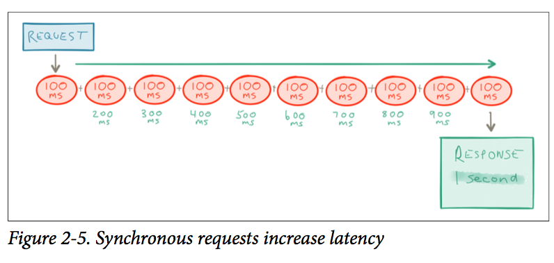
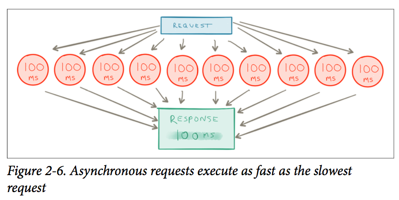
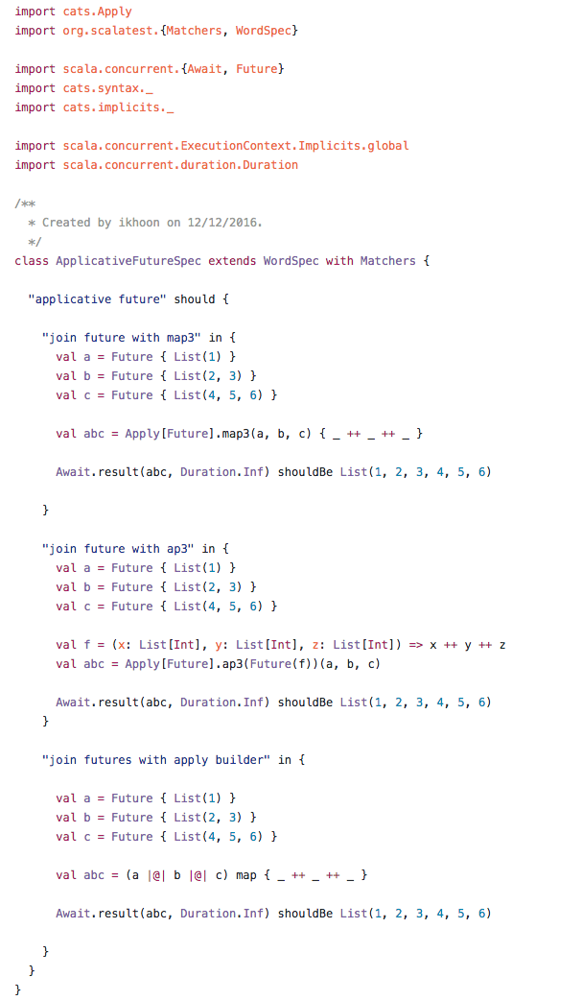
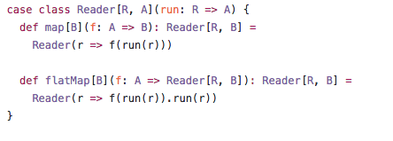
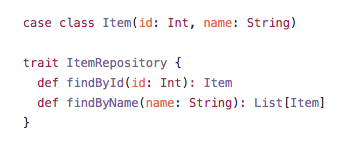
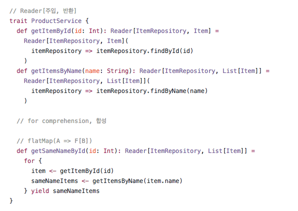
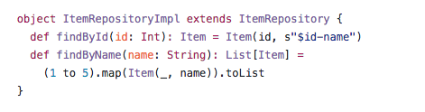
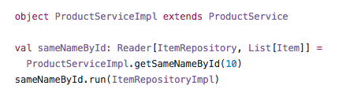

## cats나 scalaz에 보면 다양한 type class와 data type을 제공해주고 있는데 이것의 실전에,어떻게 활용할까에 대해서 궁금해하는 것 같습니다. 그 활용도에 대해서 살짝 정리해보려 합니다.^^

type class[1]는 크게 보면 아래의 4가지가 존재하고 그중 자주 쓰는 활용도에 대해서 정리하면
* Monoid - 데이터의 병렬처리
* Functor - functor자체로는 사실 임팩트는 없음
* Monad - 비동기 프로그램의 순차 처리
* Applicative - 비동기 프로그램의 병렬 처리

data type에는 아래와 같은 Monad의 자료구조형이 존재합니다. 이에 대한 많은 활용도는
* Free Monad - interpreter 패턴 구현
* Reader - 의존성 주입!
* Kleisli - Reader 비슷하지만 effect있는 함수에 대한 결합과 의존성 주입
* Writer - 효율적인 로그 생성
* State - random과 같은 side effect에 대한 효과적인 관리
물론 이외에도 scala standard library에서 제공하는 List, Either, Try, Option 같은 것도 Monad 혹은 Monadic한 자료 구조형입니다.

### Monoid

* Monoid는 값을 합치는 역할을 합니다. `append(a: A, b: A): A` 이함수를 통해서 a, b의 두개의 값을 합치는 역할을 합니다. Monoid는 결합의 법칙을 만족해야 하기 때문에 (a + b) + c = a + (b +c) 가 항상 참이어야 합니다.

이 특성은 병렬처리에 좋은 자료구조형입니다. foldLeft를하는것과 foldRight하는것이 값이 같다는 이야기 이기때문에
`List(a, b, c, d, e, f, g)` 가 있다면

```scala
foldLeft = ((((((z + a) + b) + c) + d) + e) + f) + g)
foldRight = (a + (b + (c + (d + (e + (f + (g + z)))))))
```
이렇게 처리하면 reduce(합한값)는 O(n)의 시간이 걸립니다.

여기서 monoid의 규칙을 만족하는 데이터라면
```scala
parallel_fold = (((z + a) + (b + c)) + ((d + e) + (f + g)))
```
를 병렬 처리해서 구현(divide & conqure)할수 있고 수행시간은 tree의 높이 O(log(n)) 같이 됩니다.


이를 통해서 대규모 데이터를 수행하는 Hadoop Mapreduce와 같은 곳에서 유용하게 사용할수 있습니다.

모노이드에 대한 예제코드는 아래 이미지로 첨부합니다^^


https://github.com/ikhoon/scala-exercise-note/blob/master/src/test/scala/catsnote/MonoidSpec.scala

Monoid와 Semigroup은 cats의 공식 문서[2]를 보면 더욱더 잘나와 있습니다.
   
### Monad & Applicative
   
monad와 applicative에 대해서 알고 있는 내용으로 간단하게 어떻게 적용하면 좋을지 적용 사례를 적어보겠습니다. 😀

* Monad - 비동기 프로그램의 순차 처리
* Applicative - 비동기 프로그램의 병렬 처리

Future의 flatMap은 비동기로 프로그램을 멋지게 수행하지만 순차 진행이 되기때문에 병렬 처리에는 적합하지 않습니다.



위의 그림과 같이 순차 처리는 전체 처리(응답) 속도를 느리게 하는 bottle neck이 됩니다.

이코드를 스칼라로 표현하면
```scala
 for {
   catalog <- catalogRepository.findById(item.catalogId)
   brand <- brandRepository.findById(item.brandId)
   wishCount <- itemWishCountRepository.findByItemId(item.id)
   category <- categoryRepository.findOneByBrandId(item.brandId)
   detail <- itemDetailRepository.findByItemId(item.id)
   certifications <- itemCertificationRepository.findByItemId(item.id)
} yield ProductFactory.of(item, brand, catalog, wishCount, category, detail, certifications)
```
catalog -> brand -> wishCount -> category -> detail -> certification 순으로 순차적으로 데이터를 가져를 가져오게됩니다. 비동기 프로그램은 되지만 병렬 프로그램은 아닙니다.

이를 병렬로 하려면 cats의 applicative를 활용하면 됩니다.
물론 cats의 applicative를 활용하지 않고 할 방법도 있지만 이를 활용하면 장점은 다양한 future에 대해 공통된 interface를 가질수 있는 장점이 있습니다.
cats를 사용하지 않고 직접 구현하시면 scala future를 사용하면 Future.sequence, twitter future를 사용하면 Future.join를 활용하면 됩니다.

하지만 cats를 쓰면 applicative를 활용하면 instance import만 바꾸면  twitter future이든 scala future이든 같은 코드로 작성할수 있습니다.

```scala
(
  catalogRepository.findById(item.catalogId) |@|
  brandRepository.findById(item.brandId) |@|
  itemWishCountRepository.findByItemId(item.id) |@|
  categoryRepository.findOneByBrandId(item.brandId) |@|
  itemDetailRepository.findByItemId(item.id) |@|
  itemCertificationRepository.findByItemId(item.id)
).map {
  case (catalog, brand, wishCount, category, detail, certifications) =>
    ProductFactory.of(item, brand, catalog, wishCount, category, detail, certifications)
}
```

이렇게 코드를 변경하면 아래 그림과 같이 병렬로 처리할수 있습니다.




scala future instance의 경우 import cats.implicits._ 사용하면 되고
twitter future의 instance의 경우 catbird[3]를 이용하여 import io.catbird.util._

다양한 future와 applicative의 사용법의 github[4]에 조금 올려놨습니다.



본글의 이미지는 Reactive Microservices Architecture[5] 책에 있는 것을 활용하였습니다.~


### Reader Monad

reader monad의 기본 형태는 인자로 함수를 받습니다.



ask, local같은 함수가 있지만 이부분은 생략하고 flatMap과 map만 구현해보았습니다.
여기서 중요한 점은 case class의 인자입니다. `run: R => A`의 type signature 입니다.

함수를 인자로 받기 때문에 case class는 특정함수를 field로 가지고 있습니다.
이 field를 이용해서 dependency injection에 활용할수 있습니다.
R은 우리가 주입 받고 싶은 타입이라 생각하시면 됩니다.

간단한 예를 들어보겠습니다.
아래와 같이 item을 조회하는 API가 있다고 가정해보겠습니다.
 


그리고 이 interface를 활용한 비지니스 로직을 구현해보겠습니다.
Reader Monad를 활용한 구현을 할때는 Reader 타입을 반환해야합니다.
그리고 구현시에는 `의존받는 타입 => 결과` 타입의 형태로 Reader안에 구현하면 됩니다.
`Reader(의존받고 => 반환)` 이 형태입니다.
 


위의 로직은 ItemRepository의 trait을 이용해서 구현했기 때문에 실제 구현체를 주입(injection)해주어야합니다.

이제 구현체를 구현하고 이를 실행하여 보겠습니다.

mock 데이터를 만드는 구현체입니다.


 
실제 코드를 실행하여 봅니다.
코드를 실행시에 의존성을 주입할수 있습니다.
 


특별할것 없는 간단한 코드입니다.
scala에서는 Reader Monad, type class pattern, cake pattern, freemonad 을 활용하여서 dependency injection을 구현할수 있습니다.
물론 spring이나 guice와 같은 DI framework을 할용할 수 있지만 pure하게 코드만으로 작성할수 있다는걸 보여줍니다.
게다가 위의 코드는 compile time에 동작하기 때문에 spring이나 guice처럼 runtime(서버가 부팅시)에 오류가
 생기는 상황보다 조금더 일찍 error가 catch되는 장점이 있습니다.

역시나 컴파일 타임에 에러가 잡히는건 커다란 장점인것 같습니다. 너무 간단하게 소개를 했네요.
스칼라에서 사용하는 DI에 대해서는 http://di-in-scala.github.io/ 의 글을 참조하시면 좋을것 같습니다.

참조 링크들
* https://speakerdeck.com/marakana/dead-simple-dependency-injection-in-scala
* https://github.com/ikhoon/scala-exercise-note/blob/master/scala-exercise/src/test/scala/catsnote/ReaderSpec.scala


---

[1] : http://typelevel.org/cats/typeclasses.html
[2] : http://typelevel.org/cats/typeclasses/semigroup.html
[3]: https://github.com/travisbrown/catbird
[4]: https://github.com/ikhoon/scala-exercise-note/blob/master/scala-exercise/src/test/scala/catsnote/ApplicativeFutureSpec.scala
[5]: https://info.lightbend.com/COLL-20XX-Reactive-Microservices-Architecture-RES-LP.html 

