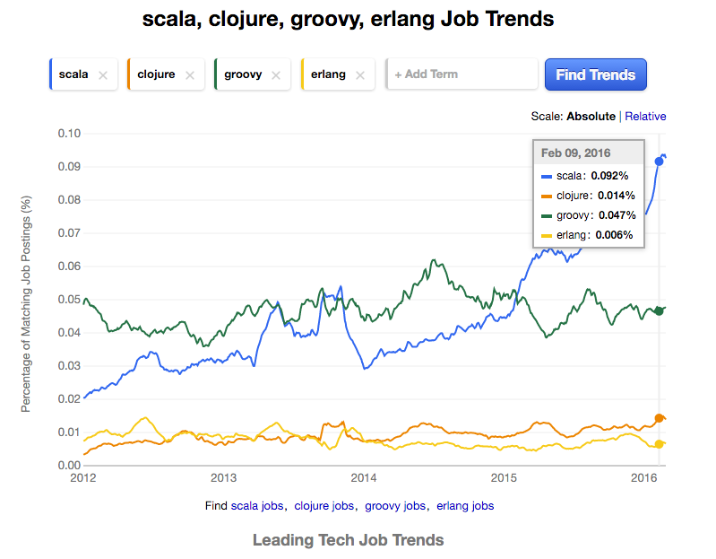
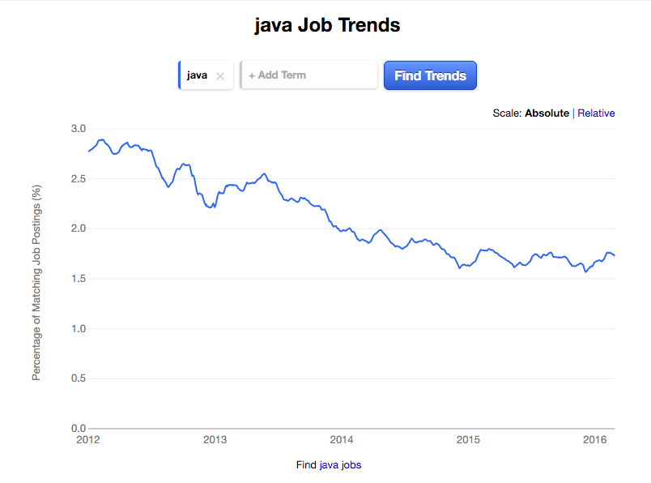
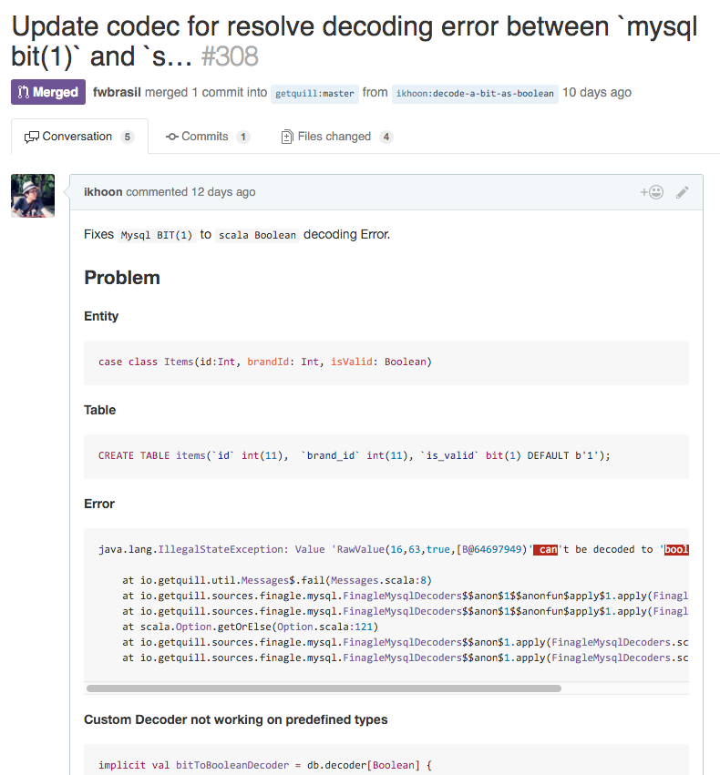
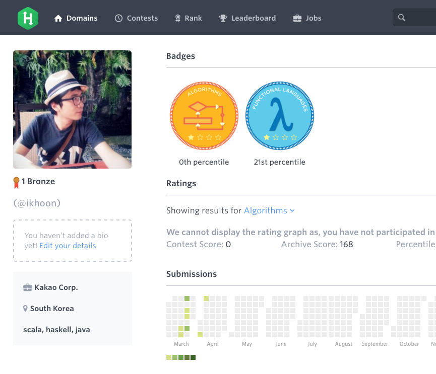

# 스칼라?<br/> 왜 해야할까요?


---------


## 1. 흙수저입니다.
스칼라는 어쩌면 노력만으로 금수저를 이길수 있습니다.
 _**Top paying tech in US**_


---------


# 2. Java는 <br/>손가락 건강에 좋지 않습니다.


---------
### 3. 흔한건 싫다. We want to be geek.


--------


## 4. 노령연금의 폐해 - 노후준비
은퇴후에 할수 remote로 일을 구할 수있습니다.

-------




[Scala Job Trends](http://www.indeed.com/jobtrends/scala%2Cclojure%2Cgroovy%2Cerlang.html)

--------

## 5. 스칼라로 코딩하는 것은  재미있습니다.

```scala
// 타입추론 - 코드가 간결해 진다.
val a : String = "world"
val b = "hello"
```

```scala
// 멋진 정규식 매칭
val str = "hello world"
val WithHello = "hello (.*)".r
str match {
  case WithHello(next) => println(next)
}
```
그외 많다.

--------



## 6. 성장하는 스칼라 커뮤니티
- 새롭게 만들어지는 프로젝트가 많다.
- scala open source contribute할 기회가 많다.
- [그들은 생각보다 친절함](https://github.com/getquill/quill/pull/308)

--------

## 7. thread pool hell은 이제 그만


### Scala는 쉽게 async 프로그래밍을 할수 있다.

// Asynchronous computations that yield futures are created with the Future call

val s = "Hello"
val f: Future[String] = Future {
  s + " future!"
}
f onSuccess {
  case msg => println(msg)
}
```

--------

## 8. 코딩이 잼있다.

> 심심할때 취미로 하기에 좋은 언어이다.



--------

## 9. Rich collection api


--------

### 10. 쉬운 에러 핸들링 - Try[T]

```scala
import scala.util.{Failure, Success, Try}
val success1: Try[String] = Success("success-1")
val success2: Try[String] = Success("success-2")
val fail: Try[String] = Failure(new IllegalStateException("Error"))

val result1 = for {
  a <- success1
  b <- fail
  c <- success2
} yield c

// result1: scala.util.Try[String] = Failure(java.lang.IllegalStateException: Some Error)
val result2 = for {
  a <- fail
  b <- success1
  c <- success2
  } yield c
// result2: scala.util.Try[String] = Failure(java.lang.IllegalStateException: Some Error)
```
